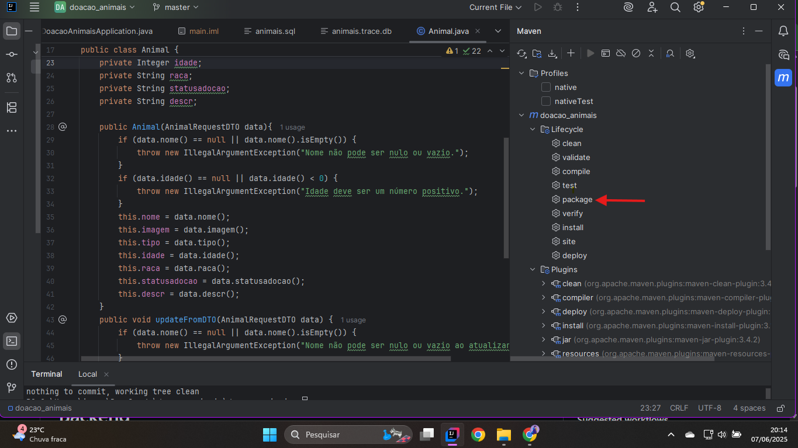
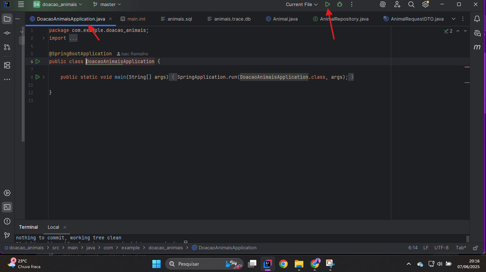

<h1>Projeto de Desenvolvimento Web - Site PetAdota - Backend</h1>

<h2>Alunos: Amanda Pereira e Isac Ramalho Sena de Lima</h2>

<p align="center">
  <a href="#pre-requisites">Pré-requisitos</a> •
  <a href="#how-to-use">Instalando o projeto</a> •
  <a href="#related">Frontend</a> •
</p>

Esta aplicação foi desenvolvida pelo grupo como parte dos requisitos para a aprovação na disciplina "Programação Orientada a Objetos 3", do UNICEUB. O projeto foi realizado utilizando Java Spring e Spring MVC para efetuar a criação do servidor, Spring Data JPA para persistência de dados e para manipulá-los, H2 como banco de dados e Lombok para gerar boilerplates. Foram utilizados, ainda, o Framework Springboot, React + Vite e Maven. O objetivo geral era criar uma aplicação web CRUD.

<h2 id="pre-requisites">💻 Requisitos</h2> 

Para rodar este projeto, é necessário ter o Java instalado.

<h2 id="how-to-use"> 🚀 Instalando o projeto</h2>

Primeiramente, é necessário clonar o repositório:

```bash
# Faça a clonagem do repositório
$ git clone https://github.com/IsacRamalho/backend_doacao_animais

# Acesse-o
$ cd crud-java-back
```

Depois, no IntelliJ, é necessário instalar as depedências com o Maven



Por último, execute o projeto no arquivo da classe `CardapioApllication`.



<h2 id="related">🫂 Integração com Frontend</h2>

Para realizar a integração com o Frontend, é preciso clonar o projeto e rodar localmente.

<h2 id="related">🫂 Referências/Agradecimentos</h2>

Gostaríamos de destacar que foram de grande ajuda a WebConferência do professor Romes Heriberto e o canal da Fernanda Kipper (https://www.youtube.com/@kipperdev).
